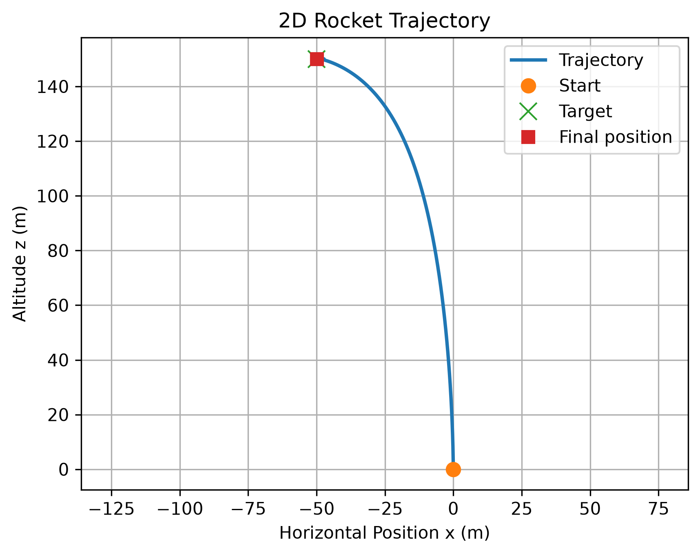
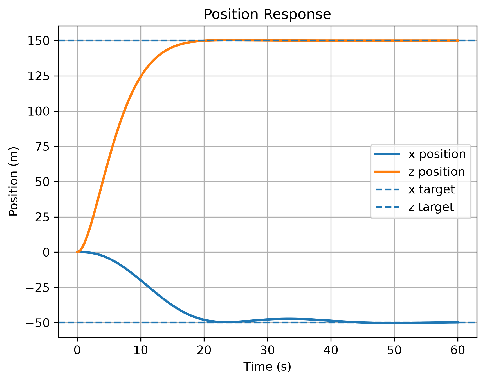
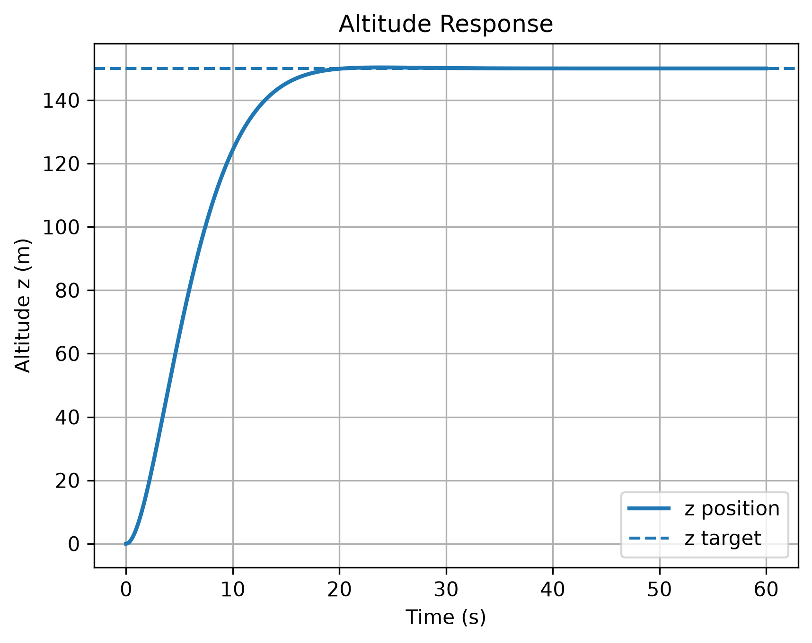
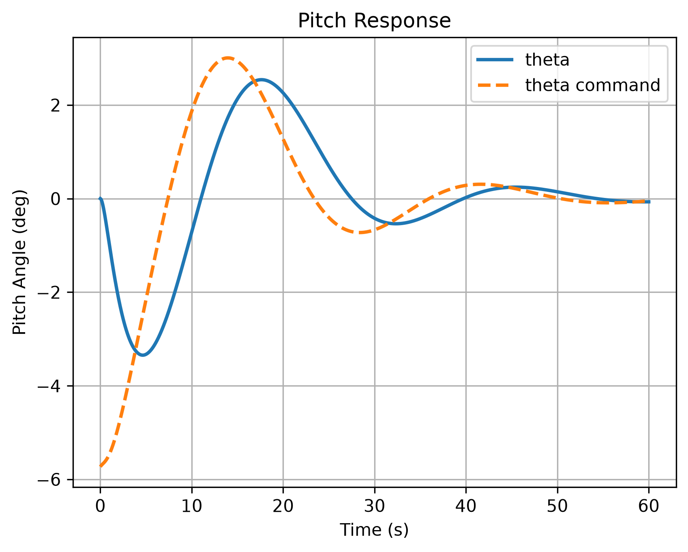

# Python Rocket TVC Simulation

## Overview

This project is a Python recreation of a simplified 2D rocket takeoff simulation with thrust vector control. The goal was to better understand the basic guidance, navigation, and control workflow by modeling rocket motion, applying feedback control, running a numerical simulation, and visualizing the system response.

The model simulates a rocket moving in the horizontal and vertical directions while also tracking pitch angle. The rocket uses thrust magnitude and gimbal angle as control inputs to move toward a commanded target position.

## Project Goal

The main goal of this project was not to create a high-fidelity launch vehicle model, but to build a clear first version of a rocket control simulation in Python. This project helped connect several important GNC concepts:

- Defining a state vector
- Writing equations of motion
- Implementing feedback control
- Applying actuator limits
- Numerically integrating the dynamics
- Plotting and interpreting the response

## Model Description

The simulated rocket uses a simplified 2D, 3 degree-of-freedom model. The state vector is:

[x, z, vx, vz, theta, q]

where:

x      = horizontal position
z      = vertical position / altitude
vx     = horizontal velocity
vz     = vertical velocity
theta  = pitch angle
q      = pitch rate

The rocket is controlled using:

T      = thrust command
delta  = gimbal angle command

The model assumes constant mass, no aerodynamic drag, and simplified pitch dynamics. These assumptions make the project easier to understand while still showing the relationship between motion, control commands, and system response.

## Control Structure

The controller is organized as a basic cascaded feedback system:

Altitude error        -> thrust command
Horizontal error      -> pitch angle command
Pitch angle error     -> gimbal command

The altitude controller commands thrust to move the rocket toward the desired height. The horizontal position controller commands a pitch angle so the rocket can lean toward the target x-position. The pitch controller then commands the gimbal angle to make the rocket follow the commanded pitch angle.

Velocity and pitch-rate feedback terms are included to help damp the response and reduce oscillation.

## Tools Used

This project was written in Python using:

- NumPy for numerical calculations and arrays
- SciPy `solve_ivp` for numerical integration of the equations of motion
- Matplotlib for plotting simulation results
- pathlib for saving figures to the project folder

## Results

The baseline simulation commands the rocket to move from the origin to a target position of:

x_target = -50 m
z_target = 150 m

The simulation reaches the target with a small final position error. The final result from the baseline case was approximately:

Final x position: -49.791 m
Final z position: 150.000 m
Total position error: 0.209 m
Final speed: 0.018 m/s

The generated plots show the rocket trajectory, position response, altitude response, and pitch response.

## Figures

### 2D Trajectory

### Position Response

### Altitude Response

### Pitch Response

## How to Run

Install the required Python packages:

pip install numpy scipy matplotlib

Then run the simulation script:

python scripts/rocket_simulation.py

The script runs the simulation, prints the final position results, creates plots, and saves the figures into the `figures` folder.

## What I Learned

Through this project, I gained more experience with the basic GNC simulation process. I learned how a rocket dynamics model can be represented as a state-space simulation, how feedback control can be used to command thrust and gimbal angle, and how response plots can be used to evaluate whether the system is stable and tracking the target correctly.

This project also helped me better understand how MATLAB/Simulink-style simulation logic can be recreated in Python using NumPy, SciPy, and Matplotlib.

## Future Work

Possible future improvements include:

- Add thrust command and gimbal command plots
- Test multiple target positions
- Save simulation results to a CSV file
- Compare Python results with the original MATLAB/Simulink model
- Add aerodynamic drag
- Add changing rocket mass due to fuel burn
- Add actuator rate limits
- Add sensor noise and a basic Kalman filter

## AI-Assisted Development Note

AI-assisted tools were used to help structure portions of the Python code, plotting, and documentation. The purpose of this project was to learn and understand the GNC workflow, including rocket dynamics, feedback control, numerical integration, actuator limits, and response visualization.